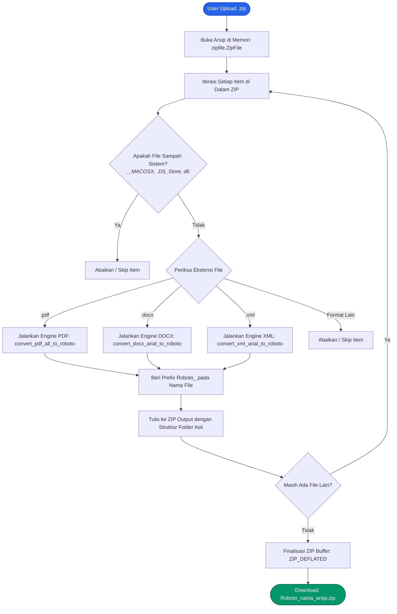
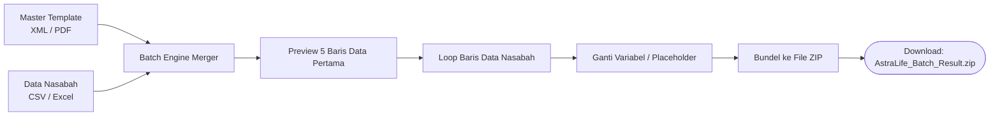

# 📘 Panduan Arsitektur & Cara Kerja Sistem (How It Works)

Dokumen ini menjelaskan secara teknis dan komprehensif alur kerja, arsitektur sistem, dan mekanisme rekayasa dokumen di balik **Tools Converting Font & Batch Mapping Merger**.

---

## 📑 Daftar Isi
1. [Alur Konversi Dokumen PDF](#1-alur-konversi-dokumen-pdf)
   - [Flowchart Lengkap](#flowchart-lengkap-konversi-pdf)
   - [Tahapan Teknis di Balik Layar](#tahapan-teknis-di-balik-layar)
2. [Alur Pemrosesan Arsip ZIP](#2-alur-pemrosesan-arsip-zip)
   - [Flowchart Ekstraksi & Repacking](#flowchart-pemrosesan-zip)
   - [Mekanisme In-Memory Streaming](#mekanisme-in-memory-streaming)
3. [Alur Konversi Dokumen DOCX & XML](#3-alur-konversi-dokumen-docx--xml)
4. [Alur Batch Mapping Merger](#4-alur-batch-mapping-merger)
5. [Prinsip Keandalan & Efisiensi Sistem](#5-prinsip-keandalan--efisiensi-sistem)

---

## 1. Alur Konversi Dokumen PDF

Proses konversi PDF ke font **Google Roboto** dirancang dengan prinsip **High-Fidelity Layout Preservation**, memastikan tata letak dokumen (tabel, logo, garis, perataan margin) tidak bergeser sama sekali saat font diganti.

### Flowchart Lengkap Konversi PDF

```mermaid
flowchart TD
    %% SUBGRAPH 1: INPUT & SETUP
    subgraph STAGE1 ["1. Input & Setup Font"]
        A([User Upload PDF]):::startNode --> B[FastAPI Endpoint: /api/convert-font]
        B --> C[Pastikan File Font Roboto TTF Siap di Local Disk<br><i>Regular, Bold, Italic, BoldItalic</i>]
        C --> D[Buka Stream Dokumen via PyMuPDF: fitz.open]
    end

    %% SUBGRAPH 2: PARSING & EKSTRAKSI
    subgraph STAGE2 ["2. Ekstraksi Struktur & Analisis Dokumen"]
        D --> E[Iterasi Setiap Halaman Dokumen]
        E --> F[Render Canvas Pixmap Halaman untuk Analisis Piksel]
        E --> G[Ekstraksi Blok Teks, Baris & Rentang Kata<br><i>page.get_text 'dict' / 'rawdict'</i>]
        G --> H[Ambil Metadata Tiap Span:<br><i>Teks, Posisi BBox, Baseline X/Y, Warna RGB, Font Asli</i>]
    end

    %% SUBGRAPH 3: FILTERING & SANITASI
    subgraph STAGE3 ["3. Pemfilteran Pintar & Sanitasi Teks"]
        F & H --> I[Sampling Piksel Warna Kanvas]
        I --> J{Teks Tertutup / Ghost Text?}
        J -- Ya --> K[Eliminasi Span Tersembunyi<br><i>Superseded / Duplicated</i>]
        J -- Tidak --> L{Apakah Simbol / Bullet Persegi?<br><i>contoh: ▪, Wingdings, dsb.</i>}
        L -- Ya --> M[Ubah Jadi Objek Vektor Geometris<br><i>Simpan koordinat rect untuk digambar</i>]
        L -- Tidak --> N[Simpan Span Teks Normal]
    end

    %% SUBGRAPH 4: GEOMETRI & AUTO-FIT
    subgraph STAGE4 ["4. Preservasi Layout & Auto-Fit Scaling"]
        N --> O[Pemetaan Varian Font Roboto<br><i>Cek flag Bold / Italic</i>]
        O --> P[Hitung Estimasi Lebar Teks Baru vs Lebar Asli]
        P --> Q{Lebar Teks Meluap / Overflow?}
        Q -- Ya --> R[Auto-Fit Scaling:<br><i>Kecilkan fontsize proporsional</i>]
        Q -- Tidak --> S[Gunakan Fontsize Asli]
        R & S --> T[Hitung Alignment & Indentasi:<br><i>Preservasi Justified Text & Numbered List</i>]
    end

    %% SUBGRAPH 5: LOW-LEVEL REDACTION
    subgraph STAGE5 ["5. Pembersihan Total Font Lama (Byte-Level)"]
        T & M --> U[Buka Low-Level Stream XREF PDF]
        U --> V[Hapus Operator Teks Lama dalam Stream:<br><i>Eleminasi seluruh blok BT ... ET</i>]
        V --> W[Bersihkan Kamus Font Lama di Resources:<br><i>Hapus referensi Arial, Times, Helvetica</i>]
    end

    %% SUBGRAPH 6: RE-INJECTION
    subgraph STAGE6 ["6. Injeksi Elemen Baru (Roboto)"]
        W --> X[Injeksi Elemen Vektor:<br><i>page.draw_rect untuk Bullet Kotak</i>]
        X --> Y[Injeksi Teks Presisi:<br><i>page.insert_text dengan Fontfile Roboto TTF Asli</i>]
    end

    %% SUBGRAPH 7: OPTIMASI & OUTPUT
    subgraph STAGE7 ["7. Kompresi & Output File"]
        Y --> Z[Sanitasi Konten: page.clean_contents]
        Z --> AA[doc.subset_fonts:<br><i>Hanya embed karakter yang dipakai</i>]
        AA --> AB[Kompilasi Byte PDF: garbage=4, deflate=True]
        AB --> AC([Download: Roboto_namafile.pdf]):::endNode
    end

    %% Styling
    classDef startNode fill:#2563EB,stroke:#1D4ED8,stroke-width:2px,color:#fff;
    classDef endNode fill:#059669,stroke:#047857,stroke-width:2px,color:#fff;
```

---

### Tahapan Teknis di Balik Layar

#### 1. Verifikasi Fontset Google Roboto
Fungsi `ensure_roboto_fonts()` memeriksa keberadaan 4 file font TTF resmi Google Roboto di direktori `assets/fonts/`:
- `Roboto-Regular.ttf`
- `Roboto-Bold.ttf`
- `Roboto-Italic.ttf`
- `Roboto-BoldItalic.ttf`

Jika file belum ada di komputer/server, aplikasi secara otomatis mengunduhnya langsung dari repository resmi Google Fonts via HTTP.

#### 2. Ekstraksi Koordinat & Analisis Geometri
Dokumen PDF dibuka dalam bentuk stream memori (`fitz.open(stream=file_bytes)`). Untuk setiap halaman:
- Pustaka PyMuPDF membaca struktur data `rawdict` yang berisi hierarki: **Halaman $\rightarrow$ Blok $\rightarrow$ Garis (*Lines*) $\rightarrow$ Span Teks**.
- Setiap span menyimpan informasi vital:
  - Teks konten (`text`)
  - Posisi koordinat baseline awal ($X, Y$)
  - Batas kotak pembatas / *Bounding Box* (`bbox`: $x_0, y_0, x_1, y_1$)
  - Ukuran huruf (`size`)
  - Warna font dalam format integer/RGB (`color`)
  - Status gaya huruf (*Bold, Italic, Superscript*)

#### 3. Deduplikasi Pintar & Proteksi Karakter Rusak
- **Suppresi Ghost Text**: Teks hasil pindaian OCR atau lapisan watermark sering meninggalkan teks duplikat di belakang bidang berwarna pekat. Sistem mengambil sampel piksel render kanvas (`page.get_pixmap()`). Jika piksel di area teks tersebut adalah satu warna solid seragam, span teks tersebut dianggap tersembunyi (*superseded*) dan tidak dirender ulang agar tidak bertumpuk ganda.
- **Handling Bullet & Simbol Non-Standar**: Simbol seperti kotak hitam (`▪`, `\u25aa`, `\uf0a7`, Wingdings) sering kali tidak memiliki glif yang cocok di font standar dan berubah menjadi kotak silang (*tofu glitch*). Sistem mendeteksi simbol ini dan mengubahnya menjadi gambar vektor murni (`page.draw_rect`) dengan warna yang identik.

#### 4. Auto-Fit Font Scaling & Preservasi Spasi
- Font Roboto memiliki metrik lebar karakter yang berbeda dengan Arial atau Times New Roman. Jika teks Roboto baru lebih panjang dari batas teks aslinya, sistem menerapkan rumus **Auto-Fit Scaling**:
  $$\text{FontSize}_{\text{baru}} = \text{FontSize}_{\text{asli}} \times \left(\frac{\text{Lebar Asli}}{\text{Lebar Teks Roboto Baru}}\right)$$
- Sistem mempertahankan spasi teks rata kanan-kiri (*justified text*) dan memastikan baris pertama daftar bernomor sejajar secara vertikal dengan teks kelanjutannya.

#### 5. Pembersihan Tingkat Rendah (*Low-Level Byte Stream Redaction*)
Agar font lama (seperti Arial, Times New Roman, Helvetica) tidak lagi terdeteksi di pembaca PDF (Adobe Acrobat / Foxit):
- Aplikasi membaca stream biner internal PDF (`doc.xref_stream`).
- Semua perintah penggambaran teks lama yang berada di antara token operator `BT` (*Begin Text*) dan `ET` (*End Text*) dipangkas bersih.
- Kamus `/Font` di dalam objek `/Resources` katalog PDF dibersihkan dari referensi font lama.

#### 6. Injeksi Ulang Font Roboto Murni
- Teks yang telah diproses digambar kembali pada posisi koordinat aslinya menggunakan metode `page.insert_text()` dengan menyematkan file `.ttf` Roboto yang sesuai (*Regular*, *Bold*, dsb.).
- Seluruh elemen gambar, logo bitmap, background, dan border tabel tetap berada di posisi aslinya tanpa modifikasi.

#### 7. Kompresi & Subsetting Font
- `doc.clean_contents()` merapikan kembali struktur PDF.
- `doc.subset_fonts()` membuang ribuan karakter glif yang tidak terpakai sehingga ukuran file PDF akhir tetap ramping dan hemat ruang penyimpanan.
- Dokumen dikompilasi dengan kompresi `deflate=True` dan `garbage=4`.

---

## 2. Alur Pemrosesan Arsip ZIP

Aplikasi mendukung konversi batch melalui arsip `.zip`. Pengguna dapat mengunggah file ZIP tunggal yang berisi puluhan hingga ratusan dokumen sekaligus.

### Flowchart Pemrosesan ZIP

### Mekanisme In-Memory Streaming
1. **Tanpa File Sementara (*Zero Disk IO*)**:
   - Seluruh proses unpacking dan packing dilakukan langsung pada RAM menggunakan `io.BytesIO`. Hal ini mencegah disk menjadi penuh dan meningkatkan kecepatan pemrosesan secara drastis.
2. **Preservasi Struktur Folder Hirarkis**:
   - Jika dokumen di dalam ZIP tersimpan di subfolder (misalnya: `Departemen/2026/Laporan.docx`), aplikasi tetap menjaga jalur folder tersebut: `Departemen/2026/Roboto_Laporan.docx`.

---

## 3. Alur Konversi Dokumen DOCX & XML

### A. Dokumen Microsoft Word (`.docx`)
1. File `.docx` dibuka menggunakan pustaka `python-docx` via `io.BytesIO`.
2. Sistem menelusuri elemen XML Office OpenXML (OOXML):
   - **Run Teks (`w:r`)**: Memeriksa elemen `<w:rFonts>` pada properti font (`ascii`, `hAnsi`, `cs`, `eastAsia`). Jika mengandung kata "Arial", nilai diganti menjadi `Roboto`.
   - **Styles Kamus**: Mengiterasi seluruh dokumen styles (`doc.styles`) dan mengalihkan default font style dari Arial ke Roboto.
   - **Tabel & Kolom**: Seluruh sel tabel dan header/footer dipindai secara rekursif.
3. Dokumen disimpan kembali ke stream biner dengan integritas XML yang valid.

### B. Dokumen XML (`.xml`)
1. Dokumen XML diparsing menggunakan `xml.etree.ElementTree`.
2. Dilakukan pemeriksaan dua lapis:
   - **Lapis Pertama (Struktur Pohon)**: Memeriksa atribut setiap elemen (seperti `font-family="Arial"` atau `name="ArialMT"`) serta teks node, lalu menggantinya dengan nilai Roboto.
   - **Lapis Kedua (Regex Fallback)**: Menggunakan pola regex `(?i)\bArial\b` untuk menangkap deklarasi font yang berada di komentar CDATA atau tag khusus template.

---

## 4. Alur Batch Mapping Merger

Fitur ini digunakan untuk mencetak dokumen personalisasi massal berdasarkan master template dan data tabular nasabah/klien.

1. **Upload & Pratinjau**:
   - Master template diunggah bersama file data nasabah (`.csv`, `.xlsx`, atau `.xls`).
   - Endpoint `/api/preview-data` membaca dataset menggunakan **pandas** dan menampilkan 5 baris pertama di antarmuka web beserta jumlah total baris data.
2. **Pengisian Data Dinamis**:
   - **Template XML**: Menggantikan token seperti `{{NAMA}}`, `{{POLIS}}`, atau kolom yang cocok di setiap baris menjadi dokumen XML individual.
   - **Template PDF**: Mengisi bidang data dokumen PDF per nasabah.
3. **Penyimpanan Terpadu**:
   - Masing-masing dokumen yang dihasilkan disimpan langsung ke dalam arsip ZIP biner dan dikembalikan ke pengguna dalam 1 file unduhan.

---

## 5. Prinsip Keandalan & Efisiensi Sistem

- **Asynchronous Architecture**: Dibangun di atas framework **FastAPI** dan **Starlette** yang efisien menangani banyak permintaan unggahan secara non-blocking.
- **Safety First**: Tidak menulis file sementara ke hardisk sistem, meminimalkan risiko kebocoran data (*data leakage*) dan masalah izin akses berkas.
- **Robust Error Handling**: Jika salah satu file di dalam arsip ZIP rusak, sistem tetap melanjutkan pemrosesan file lainnya tanpa menggagalkan seluruh antrian.
